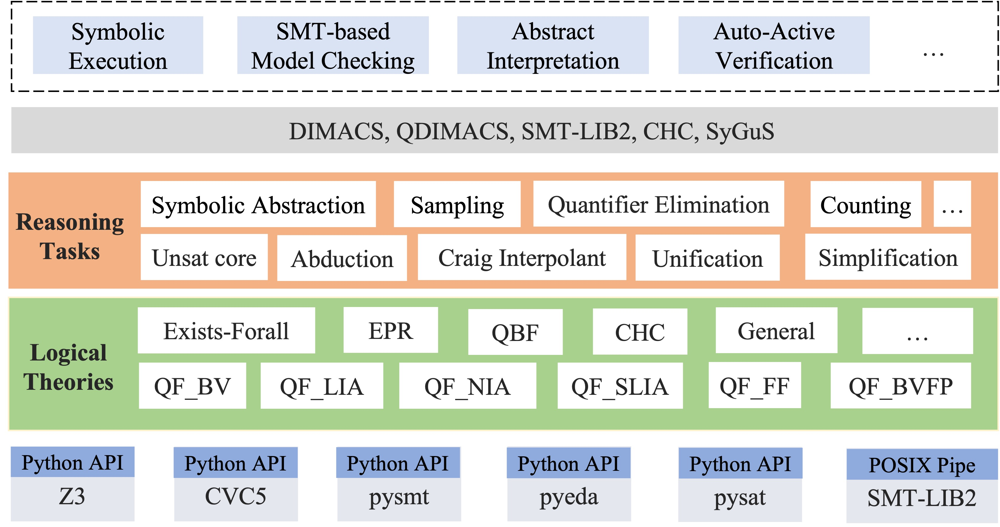

# ARIA

ARIA (Automated Reasoning Infrastructure & Applications) is a Python toolkit and research playground for automated reasoning. It collects libraries, CLI tools, and research prototypes for SAT/SMT solving, quantified reasoning, theorem proving, program verification, symbolic computation, and benchmark-driven experimentation.

<p align="center">
  
</p>

## Highlights

- SAT/SMT, MaxSAT, model counting, optimization, and theorem-proving utilities under a single repository
- Quantified-reasoning tooling in `aria.quant`, including EFSMT solvers, quantifier-elimination experiments, CHC tooling, and multiple research artifacts
- Program-analysis and verification components in `aria.efmc`, `aria.symabs`, `aria.monabs`, and related packages
- Benchmark corpora, scripts, and reproducible research infrastructure for solver-oriented experimentation

## Quantified Reasoning and PolyQEnt Context

The `aria.quant` area contains several quantified-reasoning prototypes and solver experiments. For the polynomial quantified reasoning line related to **PolyQEnt: A Polynomial Quantified Entailment Solver**, see [aria/quant/polyhorn/README.md](aria/quant/polyhorn/README.md).

## Local Development Environment

Run the following command to setup the local development environment.
~~~~
bash setup_local_env.sh
~~~~


The script will use **uv** if installed (recommended, much faster); otherwise it will prompt for venv or Conda. It will
- Create a Python virtual environment if it doesn't exist
- Install the package and its dependencies (from pyproject.toml)
- Run unit tests if available

TBD:
- Test the scripts on different platforms, editors/IDEs, etc.

## Install the Library Locally

**With uv** (recommended; install from <https://docs.astral.sh/uv/>):
~~~~
uv venv && source .venv/bin/activate   # or on Windows: .venv\Scripts\activate
uv pip install -e .
~~~~

With pip (dependencies are read from pyproject.toml):
~~~~
pip install -e .
~~~~

Then you can use the CLI tools and the Python API in your own code. Available CLI commands (also as `aria-<name>` after install): **aria-fmldoc**, **aria-mc**, **aria-pyomt**, **aria-efsmt**, **aria-efmc-efsmt**, **aria-maxsat**, **aria-unsat-core**, **aria-allsmt**, **aria-smt-server**, **aria-efmc**, **aria-polyhorn**. See [aria/cli/README.md](aria/cli/README.md) for usage and options.

## Install from PyPI

```bash
pip install aria
```

Or install the latest development version:
```bash
pip install git+https://github.com/ZJU-PL/aria.git
```

## Release the Repo to PyPI

See [PyPI Release Guide](https://github.com/ZJU-PL/aria/blob/main/RELEASE.md).

## Contributing

Contributions are welcome. Please refer to the repository for detailed instructions on how to contribute.

~~~~
aria/
├── aria/           # Main library code
├── benchmarks/      # Benchmark files and test cases
├── bin_solvers/     # Binary solver executables
├── docs/            # Documentation files
├── scripts/         # Utility scripts
├── examples/        # A few applications
└── pyproject.toml   # Package config, dependencies, and tool settings
~~~~

For Summer Research, Final Year Project Topics, please refer to
`docs/topics.rst` or `TODO.md`.

## Documentation

We release the docs here:
https://zju-pl.github.io/aria

Another doc generated by [DeepWiki](https://deepwiki.com/ZJU-PL/aria)

For quantified-reasoning-specific notes, see [aria/quant/README.md](aria/quant/README.md).

## Publications

Here are some of publications related to ARIA.

- **ATVA 2025 / arXiv 2024**: [PolyQEnt: A Polynomial Quantified Entailment Solver](https://arxiv.org/pdf/2408.03796). Krishnendu Chatterjee, Amir Kafshdar Goharshady, Ehsan Kafshdar Goharshady, Mehrdad Karrabi, Milad Saadat, Maximilian Seeliger, and Đorđe Žikelić.
- **ICSE 2024**: [Enabling Runtime Verification of Causal Discovery Algorithms with Automated Conditional Independence Reasoning](https://arxiv.org/pdf/2309.05264.pdf). Pingchuan Ma, Zhenlan Ji, Peisen Yao, Shuai Wang, and Kui Ren.
- **ICSE 2023**: Verifying Data Constraint Equivalence in FinTech Systems. Chengpeng Wang, Gang Fan, Peisen Yao, Fuxiong Pan, and Charles Zhang.
- **OOPSLA 2021**: Program Analysis via Efficient Symbolic Abstraction. Peisen Yao, Qingkai Shi, Heqing Huang, and Charles Zhang.

## Honors & Awards

- [z3-owl] ranked 3rd in the single-query tracks of [QF_ABV](https://smt-comp.github.io/2025/results/qf_abv-single-query/), [QF_AUFBV](https://smt-comp.github.io/2025/results/qf_aufbv-single-query/), and [QF_BVFP](https://smt-comp.github.io/2025/results/qf_bvfp-single-query/) at SMT-COMP 2025.

## Related Work

- [pysat](https://github.com/pysathq/pysat)
- [pysmt](https://github.com/pysmt/pysmt)
- [pyqbf](https://gitlab.sai.jku.at/qbf/pyqbf)
- [sympy](https://github.com/sympy/sympy)
- [holpy](https://github.com/bzhan/holpy)
- [iscalc](https://github.com/bzhan/iscalc)
- [amaya](https://github.com/MichalHe/amaya)
- [mypyvy](https://github.com/wilcoxjay/mypyvy)

## Contributors

Primary contributors to this project:
- rainoftime / cutelimination
- JasonJ2021
- ZelinMa557
- Harrywwq
- little-d1d1
- ljcppp
- GooduckZ
- Zahrinas
